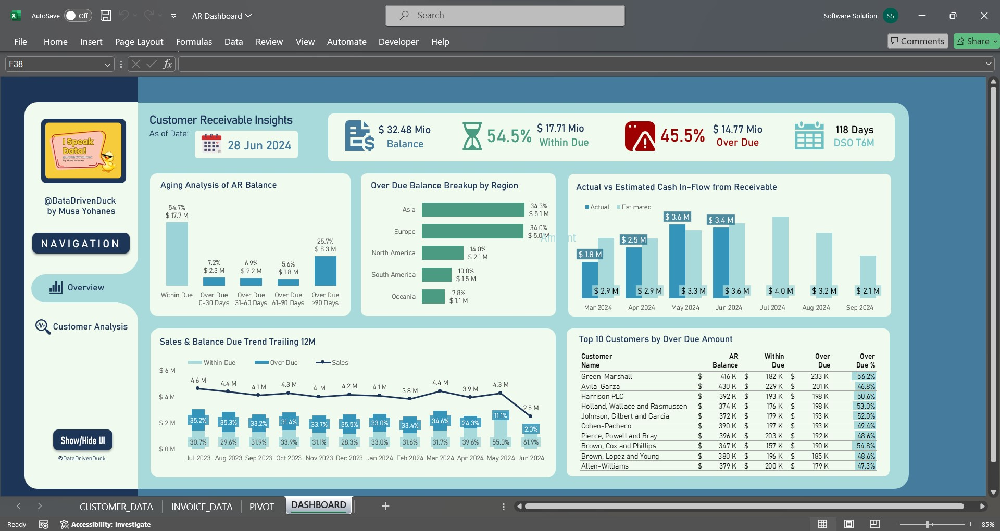
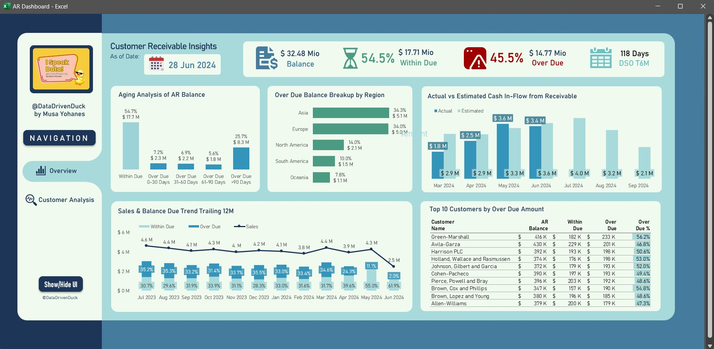
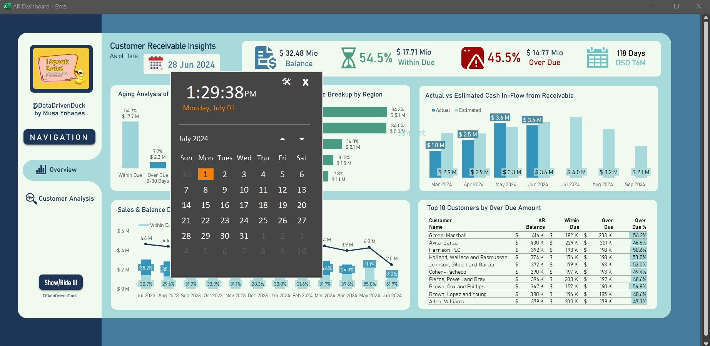
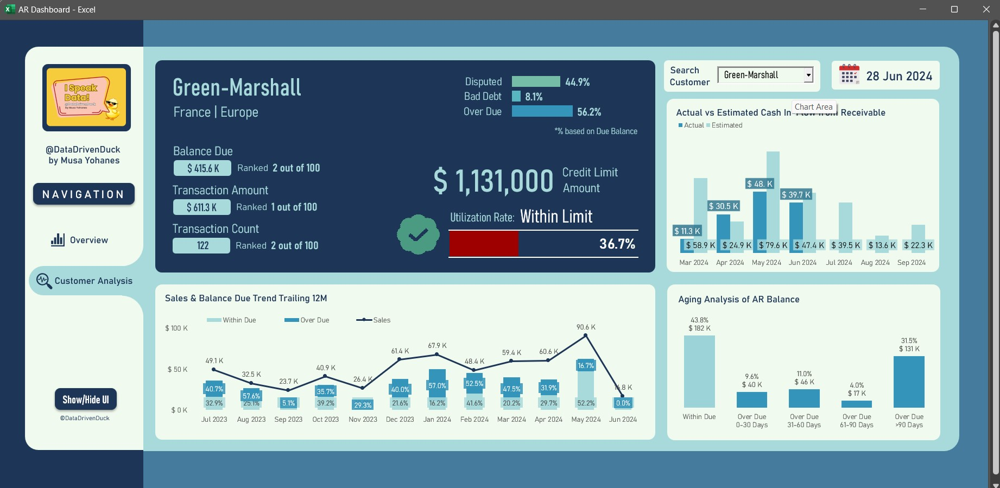
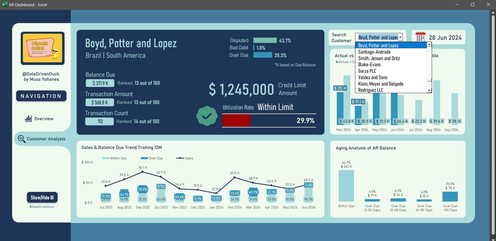

<!-- PROJECT SHIELDS -->
<!--
*** I'm using markdown "reference style" links for readability.
*** Reference links are enclosed in brackets [ ] instead of parentheses ( ).
*** See the bottom of this document for the declaration of the reference variables
*** for contributors-url, forks-url, etc. This is an optional, concise syntax you may use.
*** https://www.markdownguide.org/basic-syntax/#reference-style-links
-->

 

<h1 align="center">excel-ar-dashboard</h1>

  

    An Excel-based dashboard to help businesses monitor their Accounts Receivables 
  
  
    You can watch the project demo video on YouTube by clicking the image below:
     
     
  

## About The Project

This Excel dashboard is designed to help businesses monitor the health of their accounts receivables. It features several charts and key metrics, along with technical features such as:

- Two dashboard pages: an overview and an individual customer analysis, navigable through buttons
- A dynamic 'as of date' which serves as the base for all metric calculations, changeable through a date picker UI built with VBA
- A focused view that hides Excel's built-in UI, providing users with a clean dashboard interface

(<a href="#readme-top">back to top</a>)

## Building Blocks and Credits

This project was built using Excel formulas and **VBA 7.1** programming language.
It was made possible thanks to the following open-source modules:
- [Calendar Input Form in Excel VBA](https://stackoverflow.com/questions/54650417/how-can-i-create-a-calendar-input-in-vba-excel) by Siddharth Rout & logicworkz

(<a href="#readme-top">back to top</a>)

## Getting Started

To start using the dashboard:
1. Download the [`AR Dashboard.xlsm`](AR_Dashboard.xlsm) file.
2. Open the file, which contains all the scripts from the [`exported_vba`](exported_vba) folder (disclosed for transparency), along with worksheets for raw data, calculations, and the dashboard interface.
3. Navigate to the 'DASHBOARD' worksheet to explore the dashboard.  

Feel free to modify the dashboard or experiment with its features as needed.

(<a href="#readme-top">back to top</a>)

## Images

  
  
Overview page of the dashboard

   
  
  
Overview page with hidden Excel UI

   
  
  
'As of date' selection UI

   
  
  
Customer analysis page of the dashboard

   
  
  
Customer drop-down selection

(<a href="#readme-top">back to top</a>)

## License

Distributed under the MIT License. See [`LICENSE.txt`](LICENSE.txt) for more information.

(<a href="#readme-top">back to top</a>)

